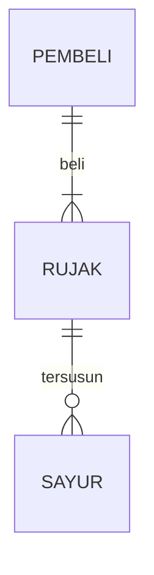

## 1.1 Latar Belakang

Tentu saja latar belakang dari pembuatan produk ini di karenakan ada beberapa masalah seperti kurangnya informasi dari pihak ponpes kepada pihak wali santri  , kurangnya pengawasan terhadap keuangan santri , dan tidak adanya sarana untuk wali santri untuk mengkritik dan memeri saran kepada pihak ponpes agar menjadi lebih baik. Sehingga di buatlah aplikasi ini untuk mewujudkan itu 

## 1.2. Deksripsi Teknologi Informasi

Melalui kesempatan ini saya akaan menjelaskan produl teknik informatika yg saya buat yakni aplikasi yg sangan membantu untuk para wali santri atau orang tua siswa yang menitipkan anak anaknya kedalam pesanntren sehingga wali santri dapat mengetahui berita atau kabar terbaru dari internal pondok ,bisa menetahui kondisi keuangan santri (anak) dari rumah ,dan bisa mengirin kritik dan saran kepada pihak ponpes
🐬 Analysis
🦉 Design
🐜 Development
🐒 Testing
🐋 Deployment
🐝 Maintenance

## 1.3. Branding

•	Merk: SAW MEDIA
•	Tagline: aplikasi berbasis untuk walisantri yg berbasis  baca berita seputar kepesantrenan secara internal, Tanya jawab dengan Pembina santri dan data keuangan santri (membayar bulalan santri dan keuangan lainya)
•	Campaign: bagaimana cara membuat wali santri atau wali siswa mengetaui akan kegiatan internal pondok dan data keuangan anak orang tua santri tersebut………..
•	Target user:
o	Walisantri 
o	Walisantri  yg ingin mengetahui kabar atau berita dari dalam ponpes
o	Walisantri  mengeksplorasi inspirasi dan informasi baru tentang ponpes
o	Walisantri yang ingin mengetahui kondisi data keuangan anaknya
o	Walisantri yang ingin memberikan saran dan kritik kepada pihak ponpes secara internal

•	User experience theme:
o	Mudah
o	Sederhana
o	Menyenangkan
o	Warna: hijau  / light yellow
o	Inspirasi desain:

## 2. User Story

bla | bla | bla | bla
---|---|---|---
bla | bla | bla | ⭐⭐⭐⭐⭐

## 3. Struktur Data

Cara membuat aneka macam bentuk grafik menggunakan mermaid.js bisa lihat di [https://mermaid.js.org/syntax/entityRelationshipDiagram.html](https://mermaid.js.org/syntax/entityRelationshipDiagram.html) 

## 4. Arsitektur Sistem

Masih pake mermaid.js juga bisa lihat flowchart di [https://mermaid.js.org/syntax/flowchart.html](https://mermaid.js.org/syntax/flowchart.html)

## 5. Teknologi, Library, dan Framework

bla bla bla

## 6. Desain User Experience dan User Interface

Bisa load image 

## 7. Demonstrasi Video

Link youtube nya

## 8. Bagaimana mesin komputasi dan sistem operasi berperan dalam produk teknologi informasimu ?

Link youtube nya di detik jawaban ini

## 9. Bagaimana algoritma, struktur data, dan bahasa pemrograman berperan dalam produk teknologi informasimu ?

Link youtube nya di detik jawaban ini

## 10. Bagaimana metode pengembangan perangkat lunak / Software Development Life Cycle berperan dalam produk teknologi informasimu ?

Link youtube nya di detik jawaban ini

## 11. Bagaimana database / sistem basis data berperan dalam produk teknologi informasimu ?

Link youtube nya di detik jawaban ini
